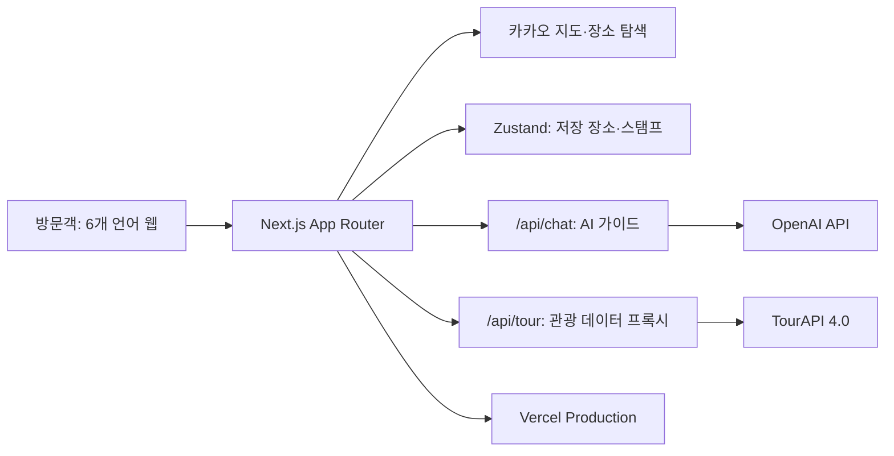

# 원곡 보더리스 (Wongok Borderless)

> 안산 원곡동 다문화거리의 음식·문화 체험을 한곳에 모으고, 지도 검색·AI 추천·GPS 스탬프 투어로 안내하는 지역 특화형 반응형 웹 서비스

**[🔗 라이브 데모](https://wongok-borderless.vercel.app)**

`2026 관광데이터 활용 공모전` 웹·앱 개발 부문 출품작

> 이 저장소는 포트폴리오 공개를 위해 새 Git 이력으로 구성한 코드 사본입니다. 공모전 지원서와 내부 제출 자료는 포함하지 않았습니다.


---

## 서비스 소개

원곡동 다문화거리는 여러 국가의 음식과 문화를 한 거리에서 경험할 수 있는 안산의 대표 관광자원입니다. 하지만 장소 정보가 지도, SNS 후기, 개별 블로그에 흩어져 있어 처음 방문하는 사람은 목적에 맞는 장소와 이동 순서를 찾기 어렵습니다.

**원곡 보더리스**는 별도 앱 설치 없이 다음 경험을 하나의 웹 서비스로 제공합니다.

- 실제 상호를 기반으로 구성한 **49개 장소** 통합 검색
- 음식·문화 성격에 따른 **4개 카테고리**와 **6개 문화권 필터**
- 카카오맵 마커와 장소 목록을 연결한 탐색
- 원곡동 데이터 안에서만 장소를 추천하는 AI 가이드
- 식사·간식·장보기·체험을 조합한 **8개 추천 코스**
- 찜한 장소 2개 이상을 안산역 출발 도보 순서로 묶어주는 **나만의 경로**
- GPS 현장 인증 기반 **8칸 스탬프 여권**
- 한국어·영어·중국어·일본어·러시아어·인도네시아어 지원

## 3분 데모 동선

1. [라이브 서비스](https://wongok-borderless.vercel.app)에서 언어를 영어로 바꿉니다.
2. 지도 검색에서 `halal`을 입력해 다국어 검색 결과를 확인합니다.
3. AI 가이드에서 `Any halal places?`를 질문하고 추천 장소를 코스에 추가합니다.
4. 지도에서 안산역 출발 도보 동선을 확인한 뒤, 장소 상세의 QR·GPS 스탬프 흐름을 확인합니다.
5. 홈 하단 안산 연계 장소에서 거리순 공공관광 데이터와 상세 정보를 엽니다.

## 서비스 아키텍처



서버 프록시가 API 키를 보호하고, 클라이언트에는 필요한 장소·관광 정보만 정제해 전달합니다. AI는 서비스에 등록된 원곡동 장소만 추천하도록 제한하며, 저장 장소는 로그인 없이 브라우저에만 보관됩니다.

### 장소 대표 사진 원칙

원곡동 개별 식당은 TourAPI에 등록되지 않은 경우가 많습니다. 현재 49개 장소는 지도 서비스에서 상호·주소를 확인했으며, 상세 화면에서는 Google Places가 동일 장소로 검증한 사진만 출처와 함께 표시합니다. 사진이 없거나 일치 검증에 실패한 장소는 다른 식당 또는 AI 생성 음식 사진을 사실처럼 사용하지 않고 문화권별 기본 비주얼로 대체합니다.

`GOOGLE_PLACES_API_KEY`를 서버에 설정한 경우에는 장소 상세 화면에서만 Google Places Text Search를 실시간 호출합니다. 전화번호가 있으면 국제 형식 검색을 우선하고, 상호·도로명·좌표를 다시 검증한 뒤 사진이 있는 결과만 표시합니다. 전화번호가 없는 곳은 상호+주소 검색 후 상호 단독 검색을 한 번 보완하며, 폐업 장소와 위치가 다른 결과는 제외합니다. Google Maps 원본 링크와 사진 작성자 표시를 이미지 위에 함께 보여줍니다. 사진 리소스 이름과 이미지는 저장·캐시하지 않습니다. 카드 목록에서는 호출하지 않아 비용을 통제합니다. 직접 촬영·사용 허가 사진은 계속 `Place.imageUrl`을 우선합니다.

## 주요 화면과 기능

| 화면 | 주요 기능 |
|---|---|
| 🏠 **홈** | 서비스 소개, 6개 문화권 바로가기, 스탬프 배너, 대표 추천 코스 3개, 안산 인근 관광지 |
| 🗺️ **지도·검색** | 장소명·음식·체험 검색, 카테고리와 문화권 이중 필터, 찜한 장소만 보기, 나만의 도보 경로, 카카오맵 마커와 장소 카드 연동 |
| ✨ **AI 가이드** | 자연어 질문에 원곡동 장소를 최대 3곳까지 추천, 다국어 답변, 추천 장소 상세·코스 연결 |
| 🧭 **추천 코스** | 세계음식·이웃의 장보기·가족 체험·야간 산책·할랄·1시간 맛보기·매운맛·면 요리 등 8개 도보 코스 |
| 🎟️ **스탬프 투어** | 6개 음식 문화권과 세계문화체험관·포토존으로 구성된 8칸 여권, GPS 인증, 3·6·8칸 단계별 배지 |
| 📍 **장소 상세** | 문화 스토리, 간판명, 위치·연락처, GPS 인증, 문화 퀴즈, 인증샷 프레임 |

### 지도 구역

- 인도네시아
- 중국동포
- 베트남
- 태국
- 인도·네팔
- 중앙아시아

### 인터랙션과 반응형 UI

- 화면 진입과 스크롤에 맞춘 순차 등장 애니메이션
- 지도 필터 선택 효과와 검색 결과 전환
- 지도 마커와 장소 카드의 양방향 선택
- 찜한 장소를 실제 좌표 기준의 가까운 순서로 정렬한 도보 경로
- 모바일 하단 탭, 데스크톱 상단 내비게이션
- 모바일과 데스크톱에 맞춘 카드·지도·코스 레이아웃
- `prefers-reduced-motion` 사용자를 위한 모션 최소화

## 기술 스택

- **Framework**: Next.js 16 App Router, React 19, TypeScript
- **Styling**: Tailwind CSS 4, CSS 애니메이션
- **State**: Zustand, localStorage persist
- **지도**: Kakao Maps JavaScript SDK, `react-kakao-maps-sdk`
- **AI**: OpenAI Chat Completions API, `gpt-4o-mini`
- **공공데이터**: 한국관광공사 OpenAPI KorService2
- **QR**: `qrcode`
- **배포**: Vercel

외부 API 키는 Next.js 서버 라우트에서 사용합니다. 브라우저 공개가 전제된 카카오 JavaScript 키만 `NEXT_PUBLIC_` 환경변수로 전달합니다.

## 프로젝트 구조

```text
src/
  app/
    page.tsx                 # 홈
    map/page.tsx             # 지도·검색
    guide/page.tsx           # AI 가이드
    course/page.tsx          # 추천 코스 8개
    stamp/page.tsx           # 8칸 스탬프 여권
    place/[id]/page.tsx      # 장소 상세·GPS 인증·퀴즈·인증샷
    api/chat/route.ts        # OpenAI 서버 프록시
    api/tour/route.ts        # 관광공사 OpenAPI 서버 프록시
    api/place-photo/route.ts # Google Places 실시간 사진 프록시·저작자 표시
  components/                # 지도, 카드, 나만의 경로, 내비게이션, QR, 공통 장식
  lib/
    constants.ts             # 구역·카테고리·코스·스탬프 정의
    sampleData.ts            # 장소 데이터와 문화 퀴즈
    routePlanner.ts          # 찜한 장소의 도보 순서·거리 계산
    tourApi.ts               # 관광공사 API 클라이언트
    i18n/                    # 6개 언어 UI·장소 번역
  store/                     # 찜·스탬프 상태
  types/                     # 공통 타입
scripts/
  check-secrets.mjs          # 커밋 대상의 API 키 검사
  install-hooks.mjs          # Git 훅 설치
```

## 로컬 실행

### 1. 저장소와 의존성 준비

```bash
git clone https://github.com/LibrumLego/wongok-borderless-portfolio.git
cd wongok-borderless-portfolio
npm ci
```

Node.js 20 이상을 권장합니다.

### 2. 환경변수 파일 생성

macOS·Linux·Git Bash:

```bash
cp .env.local.example .env.local
```

Windows PowerShell:

```powershell
Copy-Item .env.local.example .env.local
```

생성된 `.env.local`에 필요한 키를 입력합니다.

```dotenv
NEXT_PUBLIC_KAKAO_MAP_KEY=
TOUR_API_KEY=
GOOGLE_PLACES_API_KEY=
OPENAI_API_KEY=
```

### 3. 개발 서버 실행

```bash
npm run dev
```

브라우저에서 [http://localhost:3000](http://localhost:3000)을 엽니다.

키가 없어도 앱은 실행되며, 카카오맵·관광공사·AI 기능은 연결 대기 안내로 대체됩니다.

## 환경변수

| 변수 | 공개 범위 | 용도 | 발급처 |
|---|---|---|---|
| `NEXT_PUBLIC_KAKAO_MAP_KEY` | 브라우저 | 카카오맵 JavaScript SDK | [Kakao Developers](https://developers.kakao.com) |
| `TOUR_API_KEY` | 서버 전용 | 한국관광공사 OpenAPI | [공공데이터포털](https://www.data.go.kr) |
| `GOOGLE_PLACES_API_KEY` | 서버 전용 | 정확 일치 장소의 Google Places 사진 (선택) | [Google Cloud Console](https://console.cloud.google.com/) |
| `OPENAI_API_KEY` | 서버 전용 | AI 가이드 | [OpenAI Platform](https://platform.openai.com) |

> `.env.local`은 Git에서 제외됩니다. 실제 키를 코드, README, 이슈, 커밋에 넣지 마세요. 카카오 키는 사용할 도메인과 `http://localhost:3000`을 Kakao Developers에 등록해야 합니다.

OpenAI API와 Google Places API는 호출량에 따라 비용이 발생합니다. Google 사진 기능을 켜려면 Google Cloud에서 결제 계정을 연결하고 **Places API (New)**를 활성화한 뒤, 서버 전용 `GOOGLE_PLACES_API_KEY`를 Vercel Production 환경변수로 추가하세요. 테스트·운영 계정에는 사용 한도를 설정하는 것을 권장합니다.

## 검증 명령

```bash
npm run lint
npm run typecheck
npm run build
npm run check:secrets
npm run smoke:production
```

아래 명령은 린트, 타입 검사, 프로덕션 빌드를 한 번에 실행합니다.

```bash
npm run verify
```

의존성 설치 시 등록되는 Git pre-commit 훅은 커밋 대상에 실제 API 키가 포함됐는지 자동 검사합니다.

`npm run smoke:production`은 배포된 서비스의 주요 페이지, 로그인 없는 접근, TourAPI 프록시와 화면의 제공기관 노출 여부를 점검합니다. AI 호출은 비용이 발생하므로 필요할 때만 아래처럼 포함합니다.

```bash
SMOKE_CHAT=1 npm run smoke:production
```

심사 시연 순서와 실기기 점검표는 [QA 및 심사 운영 체크리스트](docs/QA_및_심사_운영_체크리스트.md)를, 제출 문안은 [기능설명서 초안](docs/1차심사_기능설명서_작성초안.md)을 참고하세요.

## API와 보안

- `/api/chat`: 같은 출처 JSON·요청 크기·메시지 길이 검증, 원곡동 관광 범위 제한, 호출 시간 제한, IP·전체 요청 제한
- `/api/tour`: 연산·날짜·콘텐츠 유형 검증, 분당 요청 제한, 외부 응답 캐시
- `/api/place-photo`: 상호·도로명·건물번호 정확 일치 검증, 상세 화면 전용, 분당 요청 제한, 사진·사진 리소스 이름 미저장
- OpenAI와 관광공사 키는 서버 라우트 밖에서 사용하지 않음
- CSP, HSTS, X-Frame-Options, Permissions-Policy 등 보안 헤더 적용
- 사용자 입력은 React 기본 이스케이프를 사용하며 HTML로 직접 삽입하지 않음

세부 개발·보안·배포 절차는 [CONTRIBUTING.md](CONTRIBUTING.md)를 참고하세요.

## 배포

프로덕션은 Vercel에서 서비스합니다.

- Production: [https://wongok-borderless.vercel.app](https://wongok-borderless.vercel.app)
- [GitHub Actions 검증 워크플로](.github/workflows/verify.yml)는 모든 push와 pull request에서 `npm ci` 후 `npm run verify`를 실행합니다.
- [운영 스모크 워크플로](.github/workflows/production-smoke.yml)는 수동 실행 또는 매주 월요일에 Production URL과 공공데이터 응답을 확인합니다.
- Vercel도 `npm run verify`를 빌드 명령으로 사용하므로, 린트·타입 검사·프로덕션 빌드 중 하나라도 실패하면 해당 배포는 완료되지 않습니다.
- Vercel Git 연동은 되어 있지만 Hobby 플랜에서는 **커밋 작성자가 Vercel 프로젝트 소유자와 같을 때만** 자동 프로덕션 배포됩니다.

```bash
npx vercel --prod --yes
```

`.git` 폴더를 옮기거나 숨기지 마세요. Vercel CLI에 로그인한 프로젝트 소유자가 위 명령으로 배포할 수 있습니다. 다만 배포가 `BLOCKED`로 끝나면 코드 문제가 아니라 Vercel 프로젝트·팀·계정의 한도 또는 정책 상태일 수 있으니, Vercel 대시보드 알림·이메일·상태 페이지를 확인한 뒤 필요하면 지원팀에 문의하세요.

로컬에서도 push 전 `npm run verify`를 통과시키세요.

## 공모전 정보

- **공모전**: 2026 관광데이터 활용 공모전 웹·앱 개발 부문
- **주최**: 한국관광공사 × Kakao
- **특화 지역**: 안산시 원곡동 다문화음식거리
